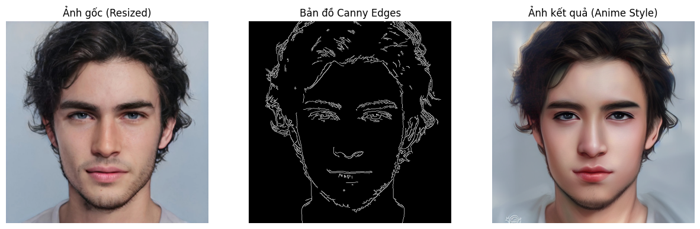
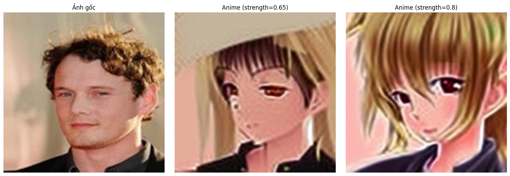

# Converting Human Photos to Anime Style



## Introduction

The "Converting Human Photos to Anime Style" project researches and implements three different approaches to solve the image-to-image translation problem. The goal is to create high-quality anime images from real human portraits while preserving recognizable features.

## Challenges

- **Identity Preservation**: Ensuring the person in the image remains recognizable after conversion
- **Image Quality**: Creating high-quality anime images without distortion
- **Consistency**: Applying anime style uniformly and naturally
- **Data Issues**: Difficulty in finding paired data

## Approaches

### 1. CycleGAN


CycleGAN is a special GAN architecture designed to perform translations between domains without requiring paired data. The model includes:
- Two generators: G_A2B (human to anime) and G_B2A (anime to human)
- Two discriminators: D_A and D_B
- Uses cycle consistency loss to ensure content preservation

#### Results:
- Model begins to show good results after approximately 30 epochs
- Reasonably good recognition of facial features
- Anime style is not yet very strong and distinct

### 2. Stable Diffusion with ControlNet



The method combining Stable Diffusion with ControlNet allows detailed control of the image generation process based on conditions from the original image:
- Uses Canny Edge, OpenPose, and other conditions from ControlNet
- Fine-tunes Stable Diffusion model with LoRA (Low-Rank Adaptation) technique
- Adjusts prompts and parameters to achieve desired results

#### Results:
- High quality and detailed images
- Good ability to preserve facial features thanks to conditions from ControlNet
- High flexibility when changing prompts to adjust anime style

### 3. Vision Transformer (ViT)


Approaching with Transformer architecture using Vision Transformer (ViT) combined with Adaptive Instance Normalization (AdaIN) technique:
- Encoder: Uses pre-trained ViT to extract features
- AdaIN: Transfers style from anime images to human photos
- Decoder: Recreates images from style-transferred features

#### Results:
- Maintains the facial structure of the original image quite well
- Anime style is not yet very distinct, mainly changes in color and smoothness
- Good potential if further developed and loss function adjusted

## Data Used
- **Human Photos**: CelebA dataset
- **Anime Images**: AnimeFace dataset
- **Preprocessing**: Resize, crop, normalize, and augmentation

## Future Development
- Combining methods to leverage advantages of each approach
- Experimenting with different hyperparameter sets
- Improving anime image quality by using higher quality data
- Building an intuitive demo interface for easy user experience

## Installation and Usage

```bash
# Clone repository
git clone https://github.com/tuantai229/AvatarAnime.git
cd anime-style-transfer

# Install dependencies
pip install -r requirements.txt

# Run inference with CycleGAN
python src/inference/cyclegan_inference.py --input_path path/to/your/image.jpg --model_path results/cyclegan/checkpoints/G_A2B_epoch_50.pth --output_dir results/inference

# Run inference with Stable Diffusion + ControlNet
python src/inference/diffusion_inference.py --input_path path/to/your/image.jpg --output_dir results/inference

# Run inference with ViT
python src/inference/vit_inference.py --content_path path/to/your/image.jpg --style_path path/to/style/image.jpg --model_path results/vit/checkpoints/model_epoch_050.pth --output_path results/inference/output.jpg
```

## References
- "Unpaired Image-to-Image Translation using Cycle-Consistent Adversarial Networks" (Zhu et al.)
- "High-Resolution Image Synthesis with Latent Diffusion Models" (Rombach et al.)
- "An Image is Worth 16x16 Words: Transformers for Image Recognition at Scale" (Dosovitskiy et al.)
- "Arbitrary Style Transfer in Real-time with Adaptive Instance Normalization" (Huang et al.)